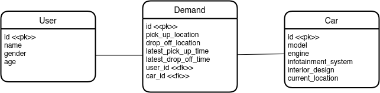

# Concept Reply

## Task 1

Einfaches ERD aus Aufgabentext. 

## Task 2 
Zum speichern der Daten wird auf SQLAlchemy mit einer SQLite Datenbank gestezt. Diese ist dann einfach in die FastAPI Umgebung einbindbar.

## Task 3
Der Schedular konnte aufgrund der Zeit nur als Skelett aufgesetzt werden. Grundidee ist das Filtern und Ranken der verfügbaren Fahrzeuge. Übergeben wird die demand anfrage, sowie eine Liste mit allen Fahrzeugen, die verfügbar sind. Filter löschen Fahrzeuge aus der Liste, Ranker erstellen einen Score, z.B. auf Basis der Entfernung. Das Fahrzeug mit dem höchsten Score wird dann zugeordnet. 

## Task 4

Test zur Nutzererstellung 